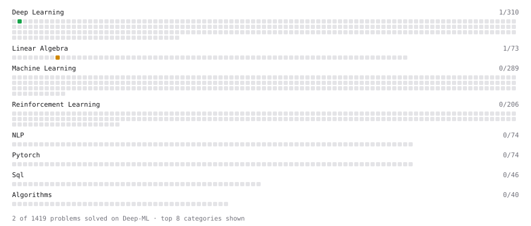

# Deep-ML

My machine learning practice from [Deep-ML](https://www.deep-ml.com). Every solution here was written by hand.

**2** solved · 2 problems · 0 labs · 0 math

[**Browse the interactive portfolio**](https://sh4shv4t.github.io/deep-ml/) to replay this filling in over time.

## Problems

| | Difficulty | Solved | |
| --- | --- | --- | --- |
| [Softmax Activation Function Implementation ](https://www.deep-ml.com/problems/23) | easy | 2026-09-17 | [solution](problems/0023-softmax-activation-function-implementation) |
| [Matrix times Matrix ](https://www.deep-ml.com/problems/9) | medium | 2026-09-17 | [solution](problems/0009-matrix-times-matrix) |

---

_This file is regenerated by Deep-ML on every push._
